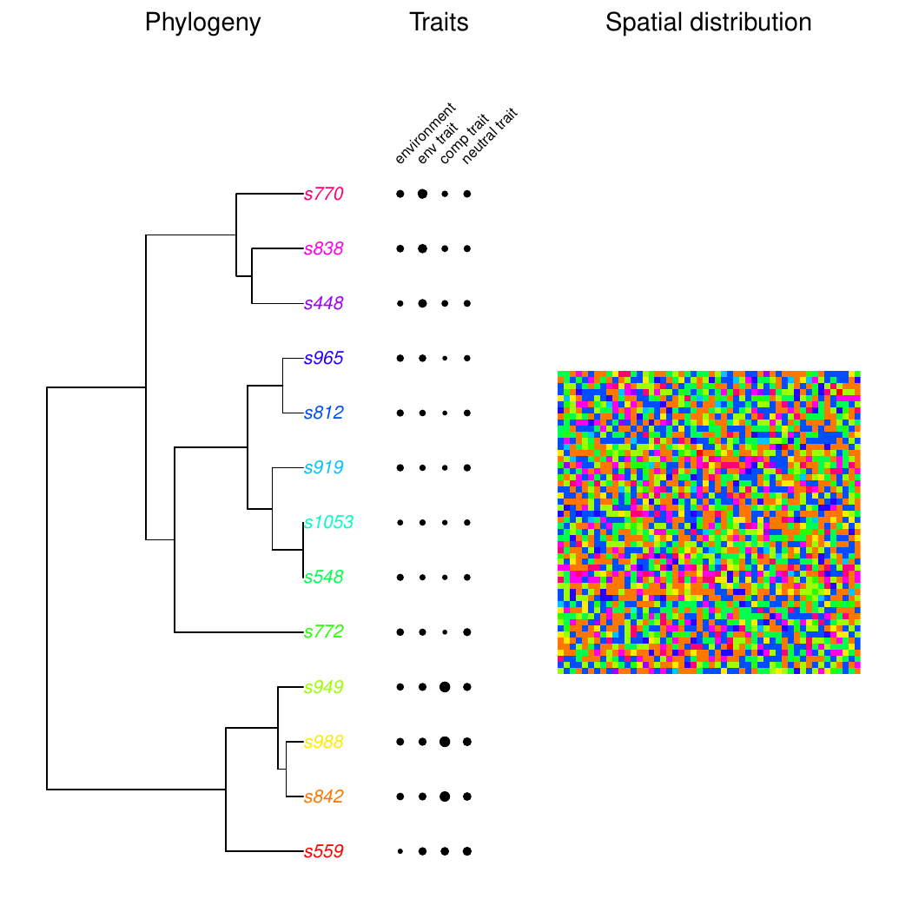
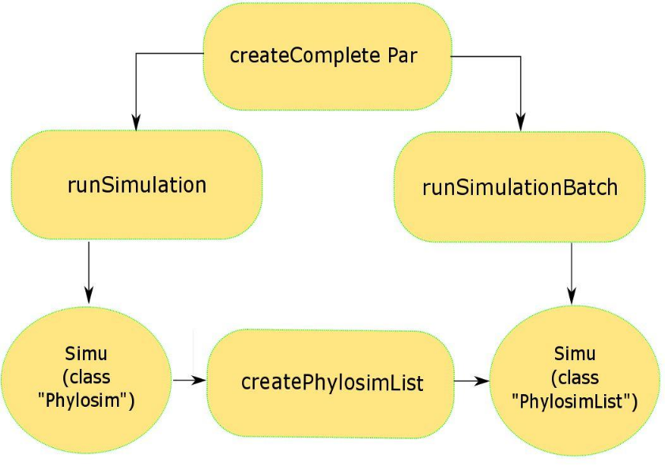
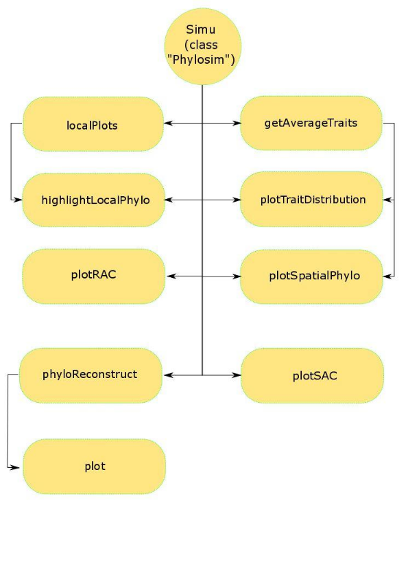

```{r setup, include = FALSE}
knitr::opts_chunk$set(
  collapse = TRUE,
  comment = "#>",
  fig.align = "center",
  fig.height = 4,
  fig.width = 4
)
```

```{r titlefig, echo = FALSE, out.width = "70%", fig.cap = "The basic output of the PhyloSim simulation: spatial distribution, phylogeny and traits in a biogeographic region."}

```

Tutorial for the PhyloSim package. Comments and contact:
[Florian Hartig](https://florianhartig.wordpress.com/) / University of Freiburg / Germany.

**Warning for the user:** consider this package to be in a beta-stage.

**To obtain the package:** the package is not officially released yet. You can
install it by typing the following code in R.

```{r install, eval = FALSE}
# install.packages(c("devtools", "Rcpp")) # in case you don't have them installed
library(devtools)
library(Rcpp)

install_url("https://dl.dropboxusercontent.com/s/zkdof0b5b523qxt/PhyloSim_0.3.tar.gz")

?PhyloSim
browseVignettes("PhyloSim")
```

**To cite the package:** use the citation information provided with the package.

```{r citation}
citation("PhyloSim")
```

This work is licensed under a Creative Commons
Attribution-NonCommercial-NoDerivatives 4.0 International License.

# Model description and running the model

## Overview

The PhyloSim package is a modelling environment for neutral and non-neutral biogeographic simulations. It generates a) spatial distribution and diversity metrics, b) phylogeny and c) traits from four basic processes: i) dispersal, ii) (adaptive) environmental preferences, iii) (adaptive) competitive traits, and iv) speciation in a stochastic simulation.

The package permits to choose between a number of options for each of these processes, and provides functions for analyzing the results, including standard biogeographic and phylogenetic summaries such as species-area curves, rank-abundance curves or phylogenetic balance and diversity.

## State variables

**The grid:** the simulation runs on a spatially discrete grid. Each cell is
occupied by one individual at any time. Additionally an environmental gradient
can be included. To avoid boundary effects the boundaries of the grid are
warped.

**Individuals:** each individual has three traits: an environmental trait, a
competition trait, and a neutral trait. The properties of these traits are
described in more detail in the section on ecological processes.

**Species and phylogeny:** each individual belongs to a species. Species
properties are described by the mean of the respective traits of all
individuals of the species. The species traits serve as an attractor in the
individual trait evolution process. Further, each species contains information
about its parent species and the species that emerged from it, which gives rise
to the overall phylogeny.

## Ecological processes

The simulation runs over a defined number of generations. In each generation,
for each individual, the following ecological processes occur:

**1. Mortality / reproduction.** If an individual dies, it is replaced by a
surrounding individual. In the base version, individuals have identical
mortalities of one per time step; however, this can be modified towards
fitness-dependent mortality rates. What *surrounding* means depends on the
dispersal kernel that is chosen. Dispersal can be either global, or it may occur
with an exponential kernel, which creates a weighting $w_d$ according to

$$ w_d = \exp\left(-\frac{d}{\delta}\right) $$

with a typical dispersal distance $\delta$ that can be set by the user. To
increase the computational speed, there is a dispersal cutoff at $2\delta$,
meaning that individuals disperse only within a distance of $2\delta$.

**2. Evolution.** The second step in the simulation of one generation is trait
evolution. Trait evolution is modelled by a small Gaussian random variable that
is added on top of the parental trait values. Additional to the random step, a
directed attraction towards the species' mean value is implemented:

$$ \mathrm{newtrait} = (1 - w_s \cdot p) + (w_s \cdot s) + (w_r \cdot r) $$

**3. Fitness calculation.** After reproduction, the new individual calculates
its fitness according to its competition and environmental traits. For example,
the closer the values of the competition traits in the surrounding of an
individual, the stronger its fitness is reduced. Numerically it can be written
as the sum of all absolute competition trait differences in a certain area
around the individual:

$$ r_i = \frac{\sum_{j=1}^{n} \lVert c_i - c_j \rVert}{n} $$

## Speciation mechanisms

After all individuals have reproduced according to steps 1--3, speciation
occurs. The default speciation mechanism is point speciation. The frequency of
these events is controlled by the speciation rate in the parameter settings.
Each generation, a number of new species is introduced in the system, replacing
randomly chosen individuals. The traits of these individuals are calculated from
the parent's traits and a randomly generated value as follows:

$$ \mathrm{newtrait} = (w_p \cdot p) + (w_r \cdot r) $$

There are several other speciation mechanisms implemented in the model:

- **Point Mutation:** a randomly chosen individual becomes a new species.
- **Fission Type 1:** a species is randomly chosen and every second individual
  of the species becomes part of a new species.
- **Fission Type 2:** a species is randomly chosen and geographically split in
  two parts. One part evolves to a new species, the other part is not affected.
- **Protracted Speciation:** based on @rosindell2010, a species undergoes an
  'incipient' stage before becoming a new species.
- **Red Queen:** based on @odwyer2014, new species have advantages over old
  species due to their novelty alone. The effect vanishes over time.

## Running the model in R

The first thing to do is, obviously, loading the package:

```{r library, message = FALSE}
library(PhyloSim)
```

Running the model consists of two consecutive steps. First, a list of parameters
is generated based on the user's settings.

```{r createpar}
par <- createCompletePar(x = 50, y = 50, dispersal = "global", runs = c(500, 1000),
                         density = 1, environment = 0.5, specRate = 1, type = "base")
```

In this example, an area of 50*50 cells provides the basis for one simulation
with outputs recorded after 500 and 1000 generations. The dispersal is set to
global, meaning each individual could reproduce in every cell of the grid.
Further, the density as well as the environment have an influence on the
individuals. For further explanations and more settings see:

```{r createpar-help, eval = FALSE}
?createCompletePar
```

The list of parameters is now used to execute the simulation:

```{r runsim, results = 'hide'}
simu <- runSimulation(par)
```

The output is saved as an object of type `Phylosim`. Each `Phylosim` object
contains two lists, `$Output` and `$Model`. All model results are saved in the
`Output` list.

In this example, the output consists of two results, the simulation after 500
and 1000 generations. They contain the spatial species matrix, the
(environmental) trait matrix, the environmental matrix (representing the
environment), the competition matrix and the neutral matrix, as well as the
phylogeny in two formats.

To access them, the easiest way is to use indices:

```{r output1}
Output1 <- simu$Output[[1]]
str(Output1)
```

The simulation settings are saved in the model object:

```{r model}
str(simu$Model)
```

The `Phylosim` object serves as the basis of all further analysis. It can
directly be passed to all other functions. If the `Phylosim` object contains
multiple results, they can be accessed by the `which.result` argument in most
functions. By default, the last result is used.

Often, users will want to run several simulations with different or equal
parameters. For this purpose, the `runSimulationBatch` function allows running a
list of parameter combinations. The function can make use of parallel computing
and returns an object of class `PhylosimList`, which is essentially a list of
`Phylosim` classes. In the following example, two slightly different parameter
sets are created and processed using parallel computing on two cores.

```{r runbatch, results = 'hide'}
par1 <- createCompletePar(x = 50, y = 50, dispersal = "global", runs = 1000,
                          density = 1, environment = 0.5, specRate = 1, type = "base")

par2 <- createCompletePar(x = 50, y = 50, dispersal = "global", runs = 1000,
                          density = 1, environment = 1, specRate = 1, type = "base")

parmBatch <- list(par1, par2)

simuBatch <- runSimulationBatch(parmBatch, parallel = 2)
```

The `simuBatch` object contains two `Phylosim` objects saved in a list. You can
easily access them separately by indexing. For example:

```{r batch-index}
simu1 <- simuBatch[[1]]
```

An overview of the basic classes and functions to run simulations is provided
below.

```{r runfig, echo = FALSE, out.width = "80%", fig.cap = "Overview of the basic model functions in the PhyloSim package. Functions are represented by bubbles, objects by circles. Objects of the class PhylosimList can be indexed if a single Phylosim object is needed."}

```

# Plots and summary statistics

After the description of the simulation environment in the previous chapter, the
present one explains plots and summary statistics that can be created from the
`Phylosim` and `PhylosimList` objects.

## Plot functions

The PhyloSim package contains multiple functions to visualize the results of the
simulation, which are summarized in the overview figure at the end of this
chapter.

**`plotSpatialPhylo`:** the easiest way to get an overview of the results of one
simulation is the `plotSpatialPhylo` function, which is also the default plot
function for a `Phylosim` object.

```{r plotspatialphylo, fig.width = 7, fig.height = 5, fig.cap = "The plotSpatialPhylo plot consists of three different figures: a phylogeny that shows the evolutionary history of the species, a trait plot that shows the trait values for each of the species (coded by size), and the spatial distribution of individuals, with colors matching the colors in the phylogeny. Which of these figures are plotted can be triggered with the arguments plot and plotTraits (see help)."}
plotSpatialPhylo(simu, plot = "both", plotTraits = TRUE, which.result = NULL)
```

**Species-area curve (SAC):** the SAC shows the accumulated species richness as
a function of area. It is calculated by creating plots of different sizes in the
meta-community.

```{r sac, results = 'hide', fig.width = 5, fig.height = 5, fig.cap = "Species richness as a function of the plot size of a local community. A positively bent curve indicates clustering of a species community. A negatively bent curve indicates a more neutral distribution of species within the community."}
sac(simu, which.result = NULL)
```

**Rank-abundance curve (RAC):** the rank-abundance curve shows the abundance of
each species within the meta-community.

```{r rac, results = 'hide', fig.width = 5, fig.height = 5, fig.cap = "Rank-abundance curve (RAC). Each species is given a rank according to its abundance (highest abundance = rank 1), then abundance is plotted against rank. A linear curve indicates a less stable or neutral community supporting only a few highly abundant species, whereas an S-shaped curve indicates a more stable community."}
rac(simu, which.result = NULL)
```

**Trait plots:** for a closer look at the traits you can visualize them using
the `plotTraitDistribution` function.

```{r traitdist, fig.width = 7, fig.height = 6, fig.cap = "The plotTraitDistribution plot consists of three figures for the three traits in the model (environmental trait, competition trait, neutral trait). The upper panel illustrates the trait magnitude as a function of the environment for different species, the middle panel the spatial distribution of the given trait, and the lower panel a histogram of the given trait."}
plotTraitDistribution(simu = simu, which.result = NULL, type = "all")
```

**Reconstructed phylogenies:** the function `phyloReconstruct` uses the species'
traits to construct a phylogeny for the given community. These phylogenies can
then be compared to the real phylogeny of the community.

```{r phylorecon, fig.width = 7, fig.height = 4, fig.cap = "Reconstructed phylogeny (left) and real phylogeny (right). There are differences in the species that make up the resulting communities as well as in their assembly."}
Phyl   <- ape::drop.fossil(simu$Output[[2]]$phylogeny)
rePhyl <- phyloReconstruct(simu)

par(mfrow = c(1, 2))
plot(rePhyl, main = "reconstructed Phylogeny")
plot(Phyl, main = "real Phylogeny")
```

**Highlight local communities:** the function `highlightLocalPhylo` highlights
the phylogeny of a local community within a metacommunity.

```{r highlight-large, fig.width = 6, fig.height = 5.4, fig.cap = "Highlights a relatively large local community."}
highlightLocalPhylo(simu, size = 10, n = 1)
```

```{r highlight-small, fig.width = 6, fig.height = 5.4, fig.cap = "Highlights a relatively small local community."}
highlightLocalPhylo(simu, size = 5, n = 1)
```

Both figures show the phylogeny of the same metacommunity but highlight different
local plots with different plot sizes (10 and 5). The larger plot is richer in
species than the smaller one.

```{r plotsfig, echo = FALSE, out.width = "70%", fig.cap = "Overview of the plotting functions in the PhyloSim package. Functions are represented by bubbles, objects by circles. The arrows illustrate what is used as input parameter for the functions."}

```

## Summary statistics

Quite a few of the functions, such as species-area curves and local
phylogenies, are based on the `localPlots` function, a simple observation model
that creates random subplots of a given size within the metacommunity.

```{r localplots}
localPlots(simu, size = 10, n = 2)
```

## Null models

To compare patterns in the results of the simulations with random expectations,
the package comprises a set of null models. The null model creates subplots from
the metacommunity and tests them against random expectations.

**The `nullModel` function:**

```{r nullmodel, eval = FALSE}
pValues <- nullModel(simu = simu, abundance = FALSE, localPlotSize = 10,
                     numberOfPlots = 20, repetitions = 100, fun = "mpd")
```

**The `calculatePhylogeneticDispersion` function:** this and its associated plot
functions are convenience functions for a rather specialized application -- the
function calculates null models for all runs in a `PhyloBatch` object and for
different plot sizes. Which null model is used is determined by the `type`
argument with the following options:

- `"PhylMeta"`: equivalent to the `nullModel` function with `abundance = FALSE`.
- `"PhylSample"`: equivalent to the `nullModel` function with `abundance = TRUE`.
- `"PhylPool"`: uses `picante::ses.mpd` with `null.model = "phylogeny.pool"`.
- `"SamplePool"`: uses `picante::ses.mpd` with `null.model = "sample.pool"`.

```{r calcphyldis, eval = FALSE}
pValuesBatch <- calculatePhylogeneticDispersion(simuBatch, plotlength = 3,
                                                plots = 20, replicates = 20,
                                                type = "PhylMeta")
```

The result can be visualized with the `plotPhylogeneticDispersion` function:

```{r plotphyldis, fig.width = 6, fig.height = 5, fig.cap = "Different combinations of dispersal limitation (y-axis), environmental trait (upper x-axis) and density dependence (lower x-axis). The colour shows the phylogenetic pattern (over- or underdispersed)."}
data("pPD.pvalues")
data("pPD.positions")

plotPhylogeneticDispersion(pvalues = pPD.pvalues, positions = pPD.positions,
                           title = "Null Meta")
```

# References
