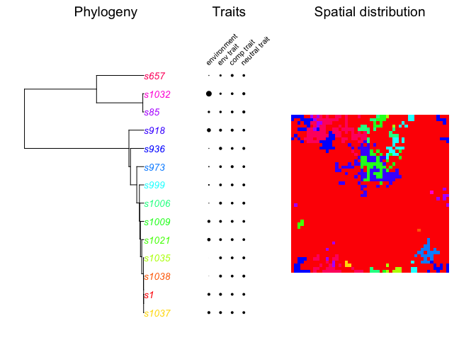
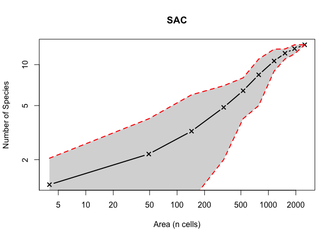

# EcoPhyloSim

A model, provided as an R package, for the simulation of spatially
explicit biogeographical and phylogenetic data.

### Installation

You can install directly from gh, using the ‘devtools’ package:

    devtools::install_github(repo = "TheoreticalEcology/EcoPhyloSim", 
                             subdir = "PhyloSim",  
                             dependencies = T, 
                             build_vignettes = T)

    ?PhyloSim
    browseVignettes("PhyloSim")

### Example

    set.seed(123)
    library(PhyloSim)

    # Define a parameter set
    par <- createCompletePar(x = 50, y = 50, dispersal = 1 , runs = 1000,
            density = 0)

    # Run the model
    simu <- runSimulation(par)

    ## [1] "Core simulation finished after 0 minute(s) and 0.496 second(s). Converting data"
    ## done!

    plot(simu)

    #Look at the species area relation
    sac(simu, rep = 100, plot= TRUE)

    ##    size sr.Mean sr.UpperCI sr.LowerCI
    ## 1     4    1.31       2.05       1.00
    ## 2    49    2.20       4.00       1.00
    ## 3   144    3.24       6.00       1.00
    ## 4   324    4.85       7.00       2.00
    ## 5   529    6.43       8.00       4.00
    ## 6   784    8.42      11.00       5.00
    ## 7  1156   10.64      13.00       8.95
    ## 8  1521   12.13      13.05      11.00
    ## 9  1936   13.11      14.00      12.00
    ## 10 2500   14.00      14.00      14.00
